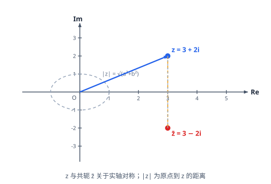

# 复数

> **范围**：必修第二册 · 第七章 ｜ 星级说明（难度 / 重要性）见[数学总览](index.md)

## 一、复数的概念

> **难度**：★★☆☆☆　**重要性**：★★★☆☆

- **虚数单位 $i$**（★☆☆☆☆）：$i^2=-1$；$i$ 的幂具有周期性：$i^1=i,\ i^2=-1,\ i^3=-i,\ i^4=1$（周期为 4）。
- **复数的定义与代数形式**（★★☆☆☆）：$z=a+bi$（$a,b \in \mathbb{R}$）；$a$ 称实部 $\mathrm{Re}(z)$，$b$ 称虚部 $\mathrm{Im}(z)$（虚部是**实数** $b$，不含 $i$）。
- **复数的分类**（★★☆☆☆）：
  - $b=0$：实数；
  - $b \ne 0$：虚数；
  - $a=0$ 且 $b \ne 0$：纯虚数。
- **复数相等**（★★★☆☆）：$a+bi=c+di \Leftrightarrow a=c$ 且 $b=d$（实部、虚部分别相等）；由此列方程组求参数。
- **求参数使复数为实数/纯虚数**（★★★☆☆）：实数 $\Leftrightarrow$ 虚部 $=0$；纯虚数 $\Leftrightarrow$ 实部 $=0$ 且虚部 $\ne 0$（**勿漏检验**）。

## 二、复数的运算

> **难度**：★★★☆☆　**重要性**：★★★★☆

- **加减法**（★★☆☆☆）：$(a+bi)\pm(c+di)=(a\pm c)+(b\pm d)i$（实部、虚部分别加减）。
- **乘法**（★★★☆☆）：$(a+bi)(c+di)=(ac-bd)+(ad+bc)i$（按多项式展开，用 $i^2=-1$ 化简）。
- **除法（分母实数化）**（★★★☆☆）：
  $$
  \frac{a+bi}{c+di}=\frac{(a+bi)(c-di)}{c^2+d^2},
  $$
  即分子分母同乘分母的共轭 $c-di$。
- **$i$ 的幂运算**（★★☆☆☆）：指数除以 4 看余数；$i^{n}-i^{n+1}+i^{n+2}-i^{n+3}=0$ 等周期求和结论。
- **共轭复数**（★★★☆☆）：$\overline{a+bi}=a-bi$；$z+\overline{z}=2a$（实数），$z-\overline{z}=2bi$，$z\cdot\overline{z}=a^2+b^2=|z|^2$。
- **整体代换与方程思想**（★★★★☆）：由 $z^2$ 或 $z+\dfrac{1}{z}$ 为实数等条件列方程；注意最后回代并检验。

## 三、复数的几何意义

> **难度**：★★★☆☆　**重要性**：★★★★☆

- **复平面**（★★★☆☆）：$z=a+bi$ 对应点 $Z(a,b)$——横轴为**实轴**、纵轴为**虚轴**；一一对应。
- **复数的模**（★★★☆☆）：
  $$
  |z|=|a+bi|=\sqrt{a^2+b^2},
  $$
  即点 $Z$ 到原点的距离。
- **模的几何应用**（★★★★☆）：$|z-z_0|$ 表示点 $Z$ 与 $Z_0$ 的距离；$|z-z_1|+|z-z_2|$ 最小值为 $|Z_1Z_2|$（三点共线取等）、$||z-z_1|-|z-z_2||$ 最大值同理——与解析几何中距离问题同构。
- **共轭的对称性**（★★★☆☆）：$z$ 与 $\overline{z}$ 关于**实轴对称**；$|z|=|\overline{z}|$。
- **复数加减的向量意义**（★★★☆☆）：$z_1+z_2$ 对应向量按平行四边形法则合成；$z_1-z_2$ 对应 $\overrightarrow{Z_2Z_1}$。

