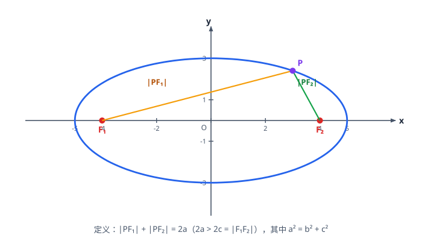
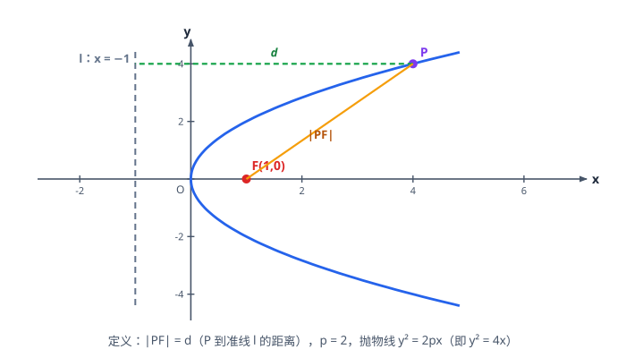

# 圆锥曲线

> **范围**：选择性必修第一册 · 第三章 ｜ 星级说明（难度 / 重要性）见[数学总览](index.md)

## 一、曲线与方程、椭圆

> **难度**：★★★☆☆　**重要性**：★★★★★

- **曲线与方程的思想**（★★★☆☆）：曲线上点的坐标都满足方程、方程的解都在曲线上；求轨迹方程五步：建系设点 → 列等式 → 代坐标 → 化简 → 检验（去掉不合题意的点）。
- **椭圆的定义**（★★☆☆☆）：平面内与两定点 $F_1,F_2$ 距离之和等于常数 $2a$（$2a>|F_1F_2|$）的点的轨迹；$2a=2c$ 时无轨迹（退化为线段条件不满足）。
- **椭圆的标准方程**（★★★☆☆）：
  $$
  \frac{x^2}{a^2}+\frac{y^2}{b^2}=1\ (a>b>0)\ \text{焦点在 }x\text{ 轴};\qquad
  \frac{y^2}{a^2}+\frac{x^2}{b^2}=1\ (a>b>0)\ \text{焦点在 }y\text{ 轴}.
  $$
- **$a,b,c$ 的关系**（★★★☆☆）：$c^2=a^2-b^2$；焦点在**分母大**的轴上；$c$ 为半焦距。
- **由条件求椭圆方程**（★★★★☆）：待定系数法（设标准式）、定义法（先求 $2a,2c$ 再得 $b$）。

## 二、椭圆的几何性质与焦点三角形

> **难度**：★★★★☆　**重要性**：★★★★★

- **范围、顶点、对称性**（★★☆☆☆）：$|x|\le a,\ |y|\le b$；四个顶点 $(\pm a,0),(0,\pm b)$；关于坐标轴、原点对称。
- **离心率**（★★★☆☆）：
  $$
  e=\frac{c}{a}\in(0,1),
  $$
  $e$ 越大椭圆越「扁」；$b^2=a^2(1-e^2)$。
- **焦点三角形**（★★★★☆）：$P$ 为椭圆上一点，$|PF_1|+|PF_2|=2a$；在 $\triangle PF_1F_2$ 中用余弦定理：
  $$
  |F_1F_2|^2=|PF_1|^2+|PF_2|^2-2|PF_1||PF_2|\cos\angle F_1PF_2,
  $$
  常用于求 $\angle F_1PF_2$ 的最值或面积 $S=\dfrac{1}{2}|PF_1||PF_2|\sin\angle F_1PF_2$。
- **椭圆中的最值**（★★★★★）：$|PF_1|$ 最大值 $=a+c$、最小值 $=a-c$（长轴端点处）；化为到焦点距离用定义转化。
- **通径（过焦点的弦）**（★★★★☆）：垂直于长轴的通径长 $=\dfrac{2b^2}{a}$（椭圆、双曲线通用），抛物线通径 $=2p$。

## 三、双曲线

> **难度**：★★★★☆　**重要性**：★★★★★

- **双曲线的定义**（★★★☆☆）：$||PF_1|-|PF_2||=2a$（$0<2a<2c$）；注意绝对值——两支均可取。
- **标准方程**（★★★☆☆）：
  $$
  \frac{x^2}{a^2}-\frac{y^2}{b^2}=1\ (a>0,b>0),
  $$
  焦点在实轴（正项对应的轴）上；$c^2=a^2+b^2$（与椭圆符号相反！）。
- **渐近线**（★★★★☆）：$y=\pm\dfrac{b}{a}x$（焦点在 $x$ 轴）；方程 $\dfrac{x^2}{a^2}-\dfrac{y^2}{b^2}=0$ 即渐近线方程；等轴双曲线 $a=b$ 时 $y=\pm x$。
- **离心率**（★★★★☆）：$e=\dfrac{c}{a}>1$，$e$ 越大开口越「阔」；渐近线斜率 $\dfrac{b}{a}=\sqrt{e^2-1}$。
- **双曲线的几何性质**（★★★☆☆）：范围 $|x|\ge a$；实轴 $2a$、虚轴 $2b$；过焦点且垂直实轴的弦（通径）$=\dfrac{2b^2}{a}$。
- **双曲线定义的应用**（★★★★☆）：$||PF_1|-|PF_2||=2a$ 与余弦定理结合（焦点三角形）；「到两定点距离之差为定值」的轨迹题用定义直接判断。

## 四、抛物线

> **难度**：★★★☆☆　**重要性**：★★★★★

- **抛物线的定义**（★★★☆☆）：到焦点 $F$ 与到准线 $l$ 距离相等的点的轨迹；$p>0$ 为焦点到准线的距离。
- **四种标准方程**（★★★☆☆）：
  | 方程 | 焦点 | 准线 |
  |------|------|------|
  | $y^2=2px$ | $\left(\dfrac{p}{2},0\right)$ | $x=-\dfrac{p}{2}$ |
  | $y^2=-2px$ | $\left(-\dfrac{p}{2},0\right)$ | $x=\dfrac{p}{2}$ |
  | $x^2=2py$ | $\left(0,\dfrac{p}{2}\right)$ | $y=-\dfrac{p}{2}$ |
  | $x^2=-2py$ | $\left(0,-\dfrac{p}{2}\right)$ | $y=\dfrac{p}{2}$ |
- **定义的转化使用**（★★★★☆）：$|PF|$ 转化为到准线距离（焦半径公式），如 $y^2=2px$ 上点 $P(x_0,y_0)$：$|PF|=x_0+\dfrac{p}{2}$。
- **焦点弦性质**（★★★★☆）：过焦点的弦 $AB$：$|AB|=x_1+x_2+p$（$y^2=2px$ 型）；$|AF|\cdot|BF|$、$\dfrac{1}{|AF|}+\dfrac{1}{|BF|}=\dfrac{2}{p}$ 等结论常用。
- **抛物线中的最值**（★★★★☆）：$|PA|+|PF|$ 型最值——把 $|PF|$ 转化为到准线的距离，化为「点到直线垂线段最短」。

## 五、直线与圆锥曲线联立（解答题核心）

> **难度**：★★★★★　**重要性**：★★★★★

- **设线联立三件套**（★★★★★）：设直线 $y=kx+m$（斜率不存在时单独讨论）$\to$ 联立消元得一元二次方程 $\to$ 写出
  $$
  \Delta>0,\qquad x_1+x_2=-\frac{B}{A},\qquad x_1x_2=\frac{C}{A}.
  $$
- **弦长公式**（★★★★☆）：
  $$
  |AB|=\sqrt{1+k^2}\,|x_1-x_2|=\sqrt{1+k^2}\sqrt{(x_1+x_2)^2-4x_1x_2}.
  $$
- **韦达定理整体代换**（★★★★★）：目标式（中点、斜率、面积、数量积）先用 $x_1+x_2,\ x_1x_2$ 表示再代入，**避免求根**。
- **中点弦与点差法**（★★★★★）：设 $A(x_1,y_1),B(x_2,y_2)$ 在曲线上，两式相减：
  - 椭圆：$k_{AB}\cdot k_{OM}=-\dfrac{b^2}{a^2}$（$M$ 为中点，$O$ 为原点）；
  - 双曲线：$k_{AB}\cdot k_{OM}=\dfrac{b^2}{a^2}$；
  - 抛物线：$y_1^2=2px_1,\ y_2^2=2px_2$ 相减得 $k_{AB}=\dfrac{2p}{y_1+y_2}$。
- **面积问题**（★★★★☆）：三角形面积用 $S=\dfrac{1}{2}|AB|\cdot d$（$d$ 为点到直线距离）或拆成水平/竖直底乘高；割补法处理不规则图形。
- **参数范围与 $\Delta$**（★★★★★）：一切含参结论都要回扣 $\Delta>0$、直线不过特殊点、坐标非零等限制，最后**取交集**。

## 六、定点、定值与存在性问题

> **难度**：★★★★★　**重要性**：★★★★☆

- **定点问题**（★★★★★）：直线系过定点（先分离参数）、曲线系恒过定点（令参数系数为 0）；「$y=k(x-1)+1$ 恒过 $(1,1)$」型。
- **定值问题**（★★★★★）：把目标式化简到与参数无关（斜率、截距消掉）；常用套路：设线 → 韦达 → 化简 → 约分。
- **存在性问题**（★★★★★）：假设存在（点/直线/角），列方程或不等式；有解且满足 $\Delta>0$ 等约束即存在，否则不存在。
- **轨迹问题**（★★★★☆）：
  - **定义法**：符合椭圆/双曲线/抛物线定义直接写方程；
  - **相关点法**：所求点 $(x,y)$ 用已知点表示，代入已知曲线；
  - **交轨法**：两动直线联立消参得交点轨迹。
- **范围与最值的综合**（★★★★★）：把几何条件（垂直、角度、面积、斜率关系）翻译成代数式后，用函数/基本不等式/导数求范围。
