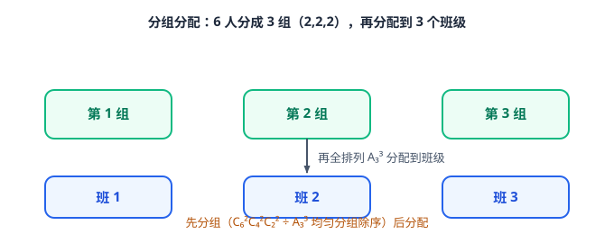
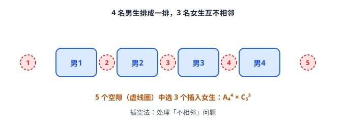

# 计数原理与二项式定理

> **范围**：选择性必修第三册 · 第一章 ｜ 星级说明（难度 / 重要性）见[数学总览](index.md)

## 一、两个计数原理

> **难度**：★★☆☆☆　**重要性**：★★★★☆

- **分类加法计数原理**（★☆☆☆☆）：完成一件事有 $n$ 类办法，各类办法互斥（**分类**），总数 $=m_1+m_2+\cdots+m_n$。
- **分步乘法计数原理**（★★☆☆☆）：完成一件事需要 $n$ 个步骤，缺一不可（**分步**），总数 $=m_1 \times m_2 \times \cdots \times m_n$。
- **两个原理的辨别**（★★★☆☆）：「分类」类类独立、「分步」步步相依；同一问题先分类、类内再分步，做到**不重不漏**。
- **元素与位置的选取标准**（★★★☆☆）：选「元素」还是选「位置」要统一；特殊元素/特殊位置**优先处理**。

## 二、排列

> **难度**：★★★☆☆　**重要性**：★★★★☆

- **排列的定义**（★★★☆☆）：从 $n$ 个不同元素中取出 $m$（$m \le n$）个**按顺序**排成一列；有序 $\Rightarrow$ 排列。
- **排列数公式**（★★★☆☆）：
  $$
  A_n^m=\frac{n!}{(n-m)!}=n(n-1)\cdots(n-m+1),\qquad A_n^n=n!.
  $$
- **排列数性质**（★★☆☆☆）：$A_n^0=1$，$A_n^1=n$；$A_{n+1}^{m+1}=(m+1)A_n^m$ 等。
- **特殊元素优先法**（★★★☆☆）：「某元素不在某位置」= 间接法（总数 $-$ 在该位置）或直接法（先排受限元素）。
- **定序问题（除序法）**（★★★★☆）：某些元素顺序固定：先全排再除以定序元素的排列数 $A_k^k$（或用组合先选位）。

## 三、组合

> **难度**：★★★☆☆　**重要性**：★★★★★

- **组合的定义**（★★★☆☆）：从 $n$ 个不同元素中取出 $m$ 个**不讲顺序**合成一组；无序 $\Rightarrow$ 组合。
- **组合数公式**（★★★☆☆）：
  $$
  C_n^m=\frac{n!}{m!(n-m)!},\qquad C_n^m=C_n^{n-m}.
  $$
- **组合数性质与方程**（★★★☆☆）：解 $C_n^x=C_n^y$：$x=y$ 或 $x+y=n$；注意 $m \le n$ 的范围限制。
- **先选后排两步法**（★★★★☆）：组合选出集合，再排列分配（选人再排位）；「有序用排列、无序用组合」。
- **分组分配问题**（★★★★★）：
  - 均匀分组（如 6 人分 3 组每组 2 人）要**除以组数的全排列** $A_3^3$（消除组间无序）；
  - 不均匀分组直接 $C_6^2C_4^2C_2^2$；
  - 分配到不同对象再乘各组的全排列。

## 四、排列组合的常用方法

> **难度**：★★★★☆　**重要性**：★★★★★

- **相邻问题——捆绑法**（★★★★☆）：某些元素相邻：先将其**内部排列**，再当作一个整体与其他元素排列。
- **不相邻问题——插空法**（★★★★☆）：某些元素不相邻：先排其余元素，再在形成的空隙中插入受限元素。
- **多重限制——特殊位置优先**（★★★★☆）：按「受限最严」的元素或位置优先安排，其余随意。
- **分组与分配（先分后配）**（★★★★★）：见上节；看清「平均/不平均」「编号/不编号」。
- **隔板法**（★★★★☆）：相同元素分给不同对象且**每份至少 1 个**：$n$ 个元素之间 $n-1$ 个空隙插 $m-1$ 块板 $=C_{n-1}^{m-1}$。
- **间接法（排除法）**（★★★★☆）：「至少」型正面分类多时，用总数 $-$ 不合题意情形。
- **数字排列问题**（★★★★☆）：组数字时**首位非 0**优先；「含/不含某数字」用排除或分类。
- **多排与环排**（★★★☆☆）：环形排列 $=A_{n-1}^{n-1}=(n-1)!$（固定一人作参照）。

## 五、二项式定理

> **难度**：★★★☆☆　**重要性**：★★★★★

- **二项式定理**（★★★☆☆）：
  $$
  (a+b)^n=\sum_{k=0}^{n}C_n^k a^{n-k}b^k\ (n \in \mathbb{N}^*),\qquad (a+b)^0=1.
  $$
- **通项公式**（★★★☆☆）：
  $$
  T_{r+1}=C_n^r a^{n-r}b^r,
  $$
  ——**第 $r+1$ 项**（勿与项数混淆）；先写通项再按条件列方程。
- **求指定项/系数**（★★★★☆）：含参数幂次问题按 $x$ 的总指数合并，令其等于目标值解 $r$；求常数项即指数为 0。
- **二项式系数的性质**（★★★★☆）：
  - 二项式系数和 $=2^n$；奇数项和 $=$ 偶数项和 $=2^{n-1}$；
  - 二项式系数最大项：$n$ 偶时中间一项 $T_{\frac n2+1}$，$n$ 奇时中间两项。
- **二项式系数与系数的区别**（★★★★☆）：「二项式系数」专指 $C_n^r$；「项的系数」是化简后 $x$ 前的数字（含 $a,b$ 中的参数），求最大项方法不同。
- **赋值法求系数和**（★★★★☆）：令 $x=1$（各项和）、$x=-1$（交错和）、$x=0$（常数项）；组合多个赋值式相减得部分系数和。
- **整除与余数问题**（★★★★☆）：把底数拆成「目标倍数 $\pm$ 小量」再二项展开，只有末几项影响余数。
- **近似计算**（★★★☆☆）：$(1+x)^n \approx 1+nx$（$|x|$ 很小时）或展开取前几项。
- **系数含参求参范围**（★★★★★）：最大项系数 $\ge$ 相邻两项系数，列不等式组解参数整数范围。
