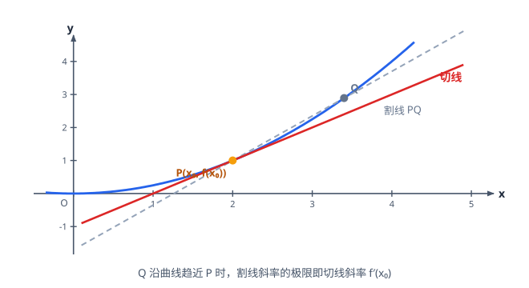

# 导数及其应用

> **范围**：选择性必修第二册 · 第二章 ｜ 星级说明（难度 / 重要性）见[数学总览](index.md)

## 一、导数的概念与几何意义

> **难度**：★★☆☆☆　**重要性**：★★★★☆

- **导数的定义**（★★☆☆☆）：
  $$
  f'(x_0)=\lim_{\Delta x \to 0}\frac{f(x_0+\Delta x)-f(x_0)}{\Delta x},
  $$
  即函数在 $x_0$ 处的**瞬时变化率**。
- **导数的几何意义**（★★☆☆☆）：$f'(x_0)$ 是曲线 $y=f(x)$ 在点 $(x_0,f(x_0))$ 处**切线的斜率**。
- **可导与连续的关系**（★★★☆☆）：可导 $\Rightarrow$ 连续；连续不一定可导（如 $y=|x|$ 在 $x=0$）。
- **物理意义**（★☆☆☆☆）：位移对时间的导数是速度，速度对时间的导数是加速度。

## 二、导数的运算

> **难度**：★★☆☆☆　**重要性**：★★★☆☆

- **基本初等函数导数公式**（★★☆☆☆）：
  $$
  (C)'=0,\quad (x^n)'=nx^{n-1},\quad (a^x)'=a^x\ln a,\quad (e^x)'=e^x,
  $$
  $$
  (\log_a x)'=\frac{1}{x\ln a},\quad (\ln x)'=\frac{1}{x},\quad (\sin x)'=\cos x,\quad (\cos x)'=-\sin x.
  $$
- **四则运算法则**（★★★☆☆）：
  $$
  (u \pm v)'=u' \pm v',\quad (uv)'=u'v+uv',\quad \left(\frac{u}{v}\right)'=\frac{u'v-uv'}{v^2}.
  $$
- **复合结构的处理**（★★★☆☆）：课内要求掌握基本类型的求导；对 $[f(x)+g(x)]$ 型先展开再求导，对乘除结构用法则拆分，**避免漏项**。
- **在某点的导数值**（★★☆☆☆）：先求 $f'(x)$ 再代 $x=x_0$；或用定义式验证。

## 三、导数与函数的单调性

> **难度**：★★★☆☆　**重要性**：★★★★★

- **单调性判定**（★★★☆☆）：在某区间内 $f'(x)>0 \Rightarrow f$ 递增；$f'(x)<0 \Rightarrow f$ 递减；端点处导数为 0 不影响（有限个点）。
- **求单调区间步骤**（★★★☆☆）：求定义域 → 求 $f'(x)$ → 解 $f'(x)>0$ 与 $f'(x)<0$ → 写区间（**定义域优先、不能写并集**）。
- **含参单调性讨论**（★★★★☆）：常见分类依据——
  1. $a$ 的正负；
  2. 二次导函数判别式 $\Delta$；
  3. 两根 $x_1,x_2$ 的**大小关系**；
  4. 根是否落在定义域内。
- **导函数含参与端点**（★★★★★）：$f'(x)=(x-a)g(x)$ 型：$g(x)>0$ 时只看 $x-a$ 变号，讨论量最小；优先因式分解不硬解。
- **已知单调性求参数范围**（★★★★★）：$f'(x) \ge 0$ 恒成立（端点可取等），分离参数或二次恒正（$\Delta \le 0$ 且开口向上），**检验取等是否真的单调**。

## 四、切线问题

> **难度**：★★★★☆　**重要性**：★★★★★

- **在点切线（切点已知）**（★★★☆☆）：斜率 $k=f'(x_0)$，点斜式 $y-f(x_0)=f'(x_0)(x-x_0)$。
- **过点切线（切点未知）**（★★★★☆）：设切点 $(t,f(t))$，斜率 $k=f'(t)$，方程过已知点代入得关于 $t$ 的方程——**注意可能多解（多条切线）**。
- **切线条数问题**（★★★★★）：过定点的切线条数 $\Leftrightarrow$ 方程 $f'(t)=\dfrac{f(t)-y_0}{t-x_0}$ 的实根个数（分离参数或构造函数看交点）。
- **两条曲线的公切线**（★★★★★）：设两个切点，斜率相等 + 两切线为同一直线（截距相等）联立。
- **切线与距离、面积综合**（★★★★☆）：先求切线方程，再算交点、距离或围成图形面积（结合定积分思想或割补）。

## 五、极值与最值

> **难度**：★★★☆☆　**重要性**：★★★★★

- **极大值与极小值**（★★★☆☆）：$f'(x)$ 在 $x_0$ 两侧**变号**——左正右负为极大、左负右正为极小；极值是**局部**概念，最值是整体概念。
- **求极值步骤**（★★★☆☆）：求定义域 → 求导 → 令 $f'(x)=0$ 得驻点 → 列表判号 → 写出极值。
- **闭区间上求最值**（★★★★☆）：比较**所有极值**与**端点函数值**，最大者为最大值；不可只看驻点。
- **含参极值讨论**（★★★★★）：驻点含参时按根的大小、是否在定义域内分类；「极值点处导数为 0」只是必要条件（$f'(x_0)=0$ 不一定是极值点，如 $y=x^3$）。
- **双极值点（零点个数）问题**（★★★★★）：$f'(x)=0$ 有两个变号根 $\Leftrightarrow y=f'(x)$ 与 $x$ 轴两交点；用 $f''$ 或因式分解判号。
- **极值点偏移思想**（★★★★★）：$f(x_1)=f(x_2)$ 且 $x_1<x_2$，证 $\dfrac{x_1+x_2}{2}>x_0$（极值点）——构造对称函数 $g(x)=f(x)-f(2x_0-x)$ 单调性分析（课内导数工具即可完成）。

## 六、恒成立、能成立与零点（压轴综合）

> **难度**：★★★★★　**重要性**：★★★★★

- **恒成立求参——分离参数法**（★★★★★）：$f(x) \ge a$ 恒成立 $\Leftrightarrow a \le f(x)_{\min}$（在定义域内求最小值，可能用到导数）。
- **恒成立求参——整体最值法**（★★★★★）：无法分离时直接求含参函数最值 $m(a)$，解 $m(a) \ge 0$；常与隐零点（$f'(x_0)=0$ 但解不出 $x_0$）结合**整体代换**。
- **能成立（存在性）问题**（★★★★☆）：$\exists x,\ f(x) \ge a \Leftrightarrow a \le f(x)_{\max}$；与恒成立只差一个最值方向。
- **双变量问题**（★★★★★）：$f(x_1) \ge g(x_2)$ 恒成立 $\Leftrightarrow f(x)_{\min} \ge g(x)_{\max}$（各自独立）；$f(x_1,x_2) \ge 0$ 型先固定一个求最值。
- **零点个数问题**（★★★★★）：分离参数转图象交点；或用单调性 + 零点存在定理逐段判号；「先增后减再增」型比较极值与 0 的大小。
- **函数不等式证明**（★★★★★）：作差构造 $F(x)$ 求最值（证 $F(x) \ge 0$）；比较法、放缩法（$e^x \ge x+1$、$\ln x \le x-1$ 等常用不等式）。
- **双零点偏移与不等式链**（★★★★★）：利用单调性把 $f(x_1),f(x_2)$ 转移到同支比较；端点恒成立检验（先猜临界值再证）。
