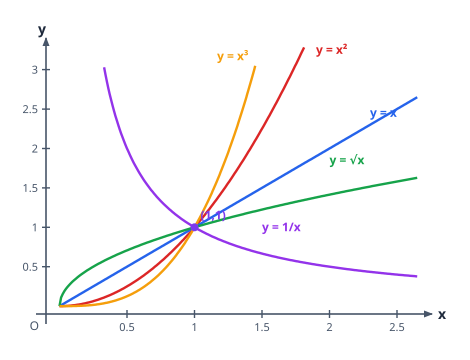
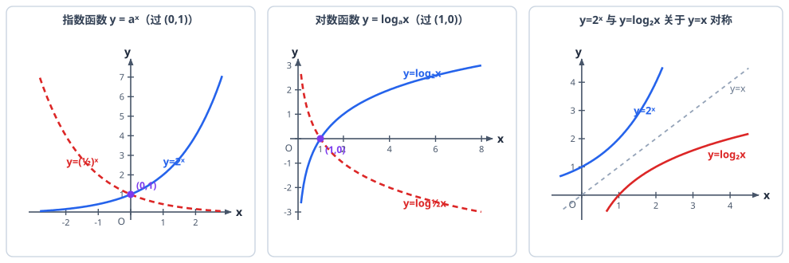

# 幂函数、指数函数与对数函数

> **范围**：必修第一册 · 第四、五章 ｜ 星级说明（难度 / 重要性）见[数学总览](index.md)

## 一、指数与指数运算

> **难度**：★★☆☆☆　**重要性**：★★★☆☆

- **根式与分数指数幂**（★★☆☆☆）：$\sqrt[n]{a^m}=a^{m/n}$（$n$ 奇数时 $a$ 任意，$n$ 偶数时 $a \ge 0$）；$a^{-n}=\dfrac{1}{a^n}$（$a \ne 0$）。
- **指数幂的运算律**（★★☆☆☆）：$a^m a^n=a^{m+n}$，$(a^m)^n=a^{mn}$，$(ab)^n=a^n b^n$（$a,b>0$）。
- **根式的化简求值**（★★★☆☆）：先统一成分数指数幂再运算；注意 $\sqrt{a^2}=|a|$，负数开偶次方要讨论。

## 二、对数与对数运算

> **难度**：★★★☆☆　**重要性**：★★★★☆

- **对数的定义**（★★☆☆☆）：$a^b=N \Leftrightarrow \log_a N=b$（$a>0,\ a \ne 1,\ N>0$）；指数式与对数式互化。
- **常用对数与自然对数**（★☆☆☆☆）：$\lg N=\log_{10}N$，$\ln N=\log_e N$。
- **对数的运算律**（★★★☆☆）：$\log_a(MN)=\log_a M+\log_a N$，$\log_a \dfrac{M}{N}=\log_a M-\log_a N$，$\log_a M^n=n\log_a M$。
- **两条常用结论**（★★☆☆☆）：$\log_a 1=0$，$\log_a a=1$；对数恒等式 $a^{\log_a N}=N$。
- **换底公式**（★★★☆☆）：$\log_a b=\dfrac{\log_c b}{\log_c a}=\dfrac{\ln b}{\ln a}$；推论 $\log_a b \cdot \log_b a=1$，$\log_{a^n} b^m=\dfrac{m}{n}\log_a b$。
- **对数式化简求值**（★★★★☆）：已知 $\lg 2 \approx 0.3010$ 等求混合值；整体代换思想（把 $\log_2 3$ 看作整体反复用运算律）。

## 三、幂函数

> **难度**：★★★☆☆　**重要性**：★★★☆☆

- **幂函数的概念**（★★☆☆☆）：形如 $y=x^\alpha$（$\alpha$ 为常数）；判断标准：指数为常数、底为自变量、系数为 1。
- **幂函数的图象与性质**（★★★☆☆）：
  - 所有幂函数都过 $(1,1)$，$\alpha>0$ 时还过 $(0,0)$；
  - 第一象限内：$\alpha>1$ 下凸增速越来越快，$0<\alpha<1$ 上凸增速变慢，$\alpha<0$ 递减且以坐标轴为渐近线；
  - 常考五个：$y=x,\ x^2,\ x^{1/2},\ x^{-1},\ x^3$。
- **由 $\alpha$ 判断象限与奇偶性**（★★★★☆）：$\alpha=\dfrac{p}{q}$（既约分数）——$q$ 偶则定义域不含负数，$p,q$ 的奇偶决定奇偶性。

## 四、指数函数

> **难度**：★★★☆☆　**重要性**：★★★★☆

- **指数函数的概念**（★☆☆☆☆）：形如 $y=a^x$（$a>0$ 且 $a \ne 1$），定义域 $\mathbb{R}$，值域 $(0,+\infty)$。
- **图象与单调性**（★★☆☆☆）：$a>1$ 时在 $\mathbb{R}$ 上**增**；$0<a<1$ 时**减**；图象恒过定点 $(0,1)$。
- **图象的上下平移**（★★☆☆☆）：$y=a^x+b$ 定点由 $(0,1)$ 变为 $(0,1+b)$；$y=a^{x-h}$ 定点为 $(h,1)$。
- **指数函数值域与最值**（★★★☆☆）：$x \in [m,n]$ 时，增函数值域 $[a^m,a^n]$，减函数 $[a^n,a^m]$；底含参要讨论 $a$ 与 1 的大小。
- **指数型方程不等式**（★★★☆☆）：$a^{f(x)}>a^{g(x)}$ 化为 $f(x)$ 与 $g(x)$ 比大小：$a>1$ 同向、$0<a<1$ 反向。

## 五、对数函数

> **难度**：★★★★☆　**重要性**：★★★★★

- **对数函数的概念**（★☆☆☆☆）：$y=\log_a x$（$a>0$ 且 $a \ne 1$），定义域 $(0,+\infty)$，值域 $\mathbb{R}$。
- **图象与性质**（★★★☆☆）：过定点 $(1,0)$；$a>1$ 时增，$0<a<1$ 时减；$x>1$ 时 $a>1 \Rightarrow y>0$、$0<a<1 \Rightarrow y<0$。
- **对数型方程不等式**（★★★★☆）：先化同底，再按底数与 1 的大小定不等号方向，最后**检验真数 $>0$**。
- **图象变换关系**（★★☆☆☆）：$y=\log_a x$ 与 $y=a^x$ 关于直线 $y=x$ 对称（互为反函数）；$y=\log_a(x-h)+k$ 过 $(1+h,k)$，竖直渐近线 $x=h$。
- **图象辨析题**（★★★★☆）：已知图象辨 $a$ 与 1 的大小、平移量——抓定点、渐近线、单调性三特征逐一排除。

## 六、指对幂综合与函数模型

> **难度**：★★★★☆　**重要性**：★★★★★

- **三个函数的增长差异**（★★☆☆☆）：$x \to +\infty$ 时，指数增长 $>$ 幂增长 $>$ 对数增长。
- **指对幂大小比较**（★★★★☆）：同指数不同底（作竖直线 $x=x_0$ 看高低）、同底不同指数、不同底不同指数（找中间量 $0,1$ 或取相同底化同底比较）。
- **中间量比较法**（★★★★☆）：以 $0$、$1$、$-1$ 等为界分组，再组内同底细化比较。
- **指数函数模型**（★★★☆☆）：$y=ka^{x}+b$ 处理增长/衰减问题；读题建模后注意定义域与实际意义（年份、人数取整）。
- **对数函数模型**（★★★☆☆）：$y=m\ln x+n$ 或 $y=a+b\lg x$；由两组数据待定系数求参，再作预测。
- **函数模型的选择**（★★★☆☆）：指数模型「爆炸式」、对数模型「先快后慢」、线性「匀速」；图表题抓增长趋势与拐点。
- **反函数概念**（★★★☆☆）：$y=a^x$ 与 $y=\log_a x$ 互为反函数，图象关于 $y=x$ 对称，定义域值域互换；求反函数：解出 $x$ $\to$ 交换 $x,y$ $\to$ 写定义域。
- **指对函数含参综合**（★★★★☆）：$y=\log_a(x^2-2x-3)$ 型——先求定义域（真数 $>0$），再讨论底数 $a$，复合层「同增异减」。
