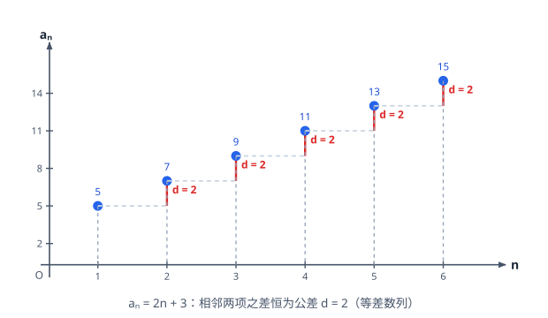

# 数列

> **范围**：选择性必修第二册 · 第一章 ｜ 星级说明（难度 / 重要性）见[数学总览](index.md)

## 一、数列的概念与通项

> **难度**：★★☆☆☆　**重要性**：★★★☆☆

- **数列的定义**（★☆☆☆☆）：按一定顺序排列的一列数；数列是**定义在正整数集（或其子集）上的特殊函数**，通项 $a_n=f(n)$。
- **通项与前 $n$ 项和**（★★☆☆☆）：
  $$
  a_n=\begin{cases} S_1, & n=1 \\ S_n-S_{n-1}, & n\ge 2 \end{cases}
  $$
  ——**必须分 $n=1$ 与 $n\ge2$ 讨论**，再检验 $n=1$ 能否并入。
- **由递推求通项——累加法**（★★★☆☆）：$a_{n+1}-a_n=f(n)$ 型，累加得 $a_n=a_1+\sum_{k=1}^{n-1}f(k)$。
- **由递推求通项——累乘法**（★★★☆☆）：$\dfrac{a_{n+1}}{a_n}=f(n)$ 型，累乘得 $a_n=a_1\prod f(k)$。
- **数列的函数性质**（★★★☆☆）：$a_n$ 关于 $n$ 的增减性即数列单调性；$S_n$ 的最值看 $a_n$ 的变号点（$a_n$ 由负转正则 $S_n$ 最小）。

## 二、等差数列

> **难度**：★★☆☆☆　**重要性**：★★★★★

- **定义与通项**（★★☆☆☆）：$a_{n+1}-a_n=d$（公差）；$a_n=a_1+(n-1)d$；推广 $a_n=a_m+(n-m)d$。
- **等差中项**（★★☆☆☆）：$2b=a+c \Leftrightarrow a,b,c$ 成等差数列。
- **性质：下标和相等**（★★★☆☆）：$m+n=p+q \Rightarrow a_m+a_n=a_p+a_q$；$2a_n=a_{n-1}+a_{n+1}$。
- **前 $n$ 项和**（★★☆☆☆）：
  $$
  S_n=\frac{n(a_1+a_n)}{2}=na_1+\frac{n(n-1)}{2}d,
  $$
  $S_n$ 是关于 $n$ 的**常数项为 0 的二次函数**。
- **$S_n$ 的最值**（★★★☆☆）：找使 $a_n$ 变号的 $n$：$a_n \le 0 \le a_{n+1}$（递增数列时 $S_n$ 最小）；或用二次函数对称轴取整。
- **等差数列求参**（★★★☆☆）：$a_1,d$ 两个基本量——已知两个条件（如 $S_n$ 表达式、某几项和）列方程组。
- **$S_n$ 与 $a_n$ 关系综合**（★★★★☆）：$S_n=An^2+Bn$ 型直接读出 $a_1=A+B$、$d=2A$。

## 三、等比数列

> **难度**：★★★☆☆　**重要性**：★★★★★

- **定义与通项**（★★★☆☆）：$\dfrac{a_{n+1}}{a_n}=q$（公比，$q \ne 0$）；$a_n=a_1q^{n-1}$。
- **等比中项**（★★★☆☆）：$G^2=ac$（$a,c$ 同号时 $G=\pm\sqrt{ac}$；注意**两解**）。
- **性质：下标和相等**（★★★☆☆）：$m+n=p+q \Rightarrow a_ma_n=a_pa_q$；$a_n^2=a_{n-1}a_{n+1}$。
- **前 $n$ 项和**（★★★☆☆）：
  $$
  S_n=\begin{cases} na_1, & q=1 \\ \dfrac{a_1(1-q^n)}{1-q}=\dfrac{a_1-a_nq}{1-q}, & q\ne 1 \end{cases}
  $$
  ——**$q=1$ 必须单独讨论**（高频失分点）。
- **等比数列求参**（★★★★☆）：由条件分 $q=1$ 与 $q \ne 1$ 两种情况列式，最后检验 $q \ne 0$ 与各项符号。
- **$S_n$ 型递推**（★★★★☆）：$S_n$ 与 $a_n$ 混合式先化为 $S_n$ 的递推或用 $a_n=S_n-S_{n-1}$ 转化。

## 四、数列求和方法

> **难度**：★★★★☆　**重要性**：★★★★★

- **公式法**（★★☆☆☆）：等差、等比直接代公式；常见数列和 $\sum k=\dfrac{n(n+1)}{2}$、$\sum k^2=\dfrac{n(n+1)(2n+1)}{6}$（了解）。
- **分组求和**（★★★★☆）：通项拆成可分别求和的两部分，如 $a_n=n+2^n$ 分成等差 + 等比各自求和。
- **裂项相消**（★★★★☆）：把通项拆成差：$\dfrac{1}{n(n+1)}=\dfrac{1}{n}-\dfrac{1}{n+1}$，$\dfrac{1}{\sqrt{n}+\sqrt{n+1}}=\sqrt{n+1}-\sqrt{n}$；**注意首末项保留几项**。
- **错位相减**（★★★★☆）：等差 $\times$ 等比型 $a_n=(An+B)q^n$：$S_n$ 与 $qS_n$ 相减；**对齐项、错一位相减**，最后算等比子和。
- **倒序相加**（★★★☆☆）：与首尾对称的和，正写反写相加配对。
- **奇偶项分段求和**（★★★★☆）：含 $(-1)^n$ 或 $n$ 奇偶分类的通项，分奇偶讨论 $S_n$。
- **验证与化简**（★★★☆☆）：求和后用 $n=1,2$ 验证，防止错项漏项。

## 五、递推与构造

> **难度**：★★★★☆　**重要性**：★★★★☆

- **$a_{n+1}=pa_n+q$ 型（$p \ne 1$）**（★★★★☆）：待定构造 $a_{n+1}+\lambda=p(a_n+\lambda)$，解得 $\lambda=\dfrac{q}{p-1}$，化为等比数列。
- **$a_{n+1}=pa_n+q^n$ 型**（★★★★★）：两边同除 $q^{n+1}$ 或再构造；视 $p,q$ 大小关系选方法。
- **分式递推 $a_{n+1}=\dfrac{Aa_n+B}{Ca_n+D}$**（★★★★★）：不动点法（解 $x=\dfrac{Ax+B}{Cx+D}$）化等差/等比；或取倒数降次。
- **周期数列**（★★★☆☆）：递推几步后回到初值即周期，按周期分段求和。
- **$S_n$ 与 $a_n$ 混合递推**（★★★★☆）：$2S_n=a_n+1$ 型：写 $n \to n-1$ 两式相减得 $a_{n+1}$ 与 $a_n$ 关系，再定类型。

## 六、数列不等式与综合

> **难度**：★★★★★　**重要性**：★★★★☆

- **放缩求和（常见模板）**（★★★★★）：
  - $\dfrac{1}{n(n+1)}<\dfrac{1}{n^2}<\dfrac{1}{n(n-1)}\ (n \ge 2)$；
  - $\dfrac{1}{\sqrt{n}}>\dfrac{2}{\sqrt{n}+\sqrt{n+1}}=2(\sqrt{n+1}-\sqrt{n})$；
  - 等比放缩：$q^n$ 型用无穷等比和 $\dfrac{a_1}{1-q}$ 控制上界。
- **数列型不等式证明**（★★★★★）：先求和/求通项，再作差比较或数学归纳思想（验证 $n=1$、假设 $n=k$ 推 $n=k+1$ 的思路）。
- **恒成立求参数**（★★★★★）：分离参数 $m<f(n)$ 恒成立 $\Leftrightarrow m<f(n)_{\min}$（或 $m>S_n^{\max}$），转为数列最值。
- **数列与函数、导数综合**（★★★★★）：把 $a_n$ 看作 $f(n)$ 用导数研究单调性，注意 $n \in \mathbb{N}^*$ 的离散性（端点取整）。
