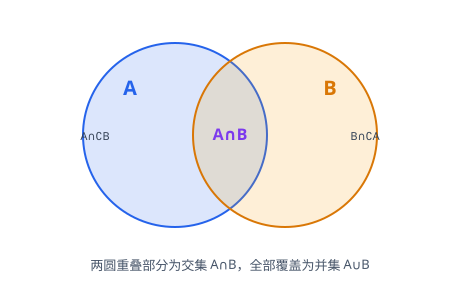

# 集合与常用逻辑用语

> **范围**：必修第一册 · 第一章 ｜ 星级说明（难度 / 重要性）见[数学总览](index.md)

## 一、集合的概念与表示

> **难度**：★☆☆☆☆　**重要性**：★★★☆☆

- **集合与元素的概念**（★☆☆☆☆）：把确定、互不相同的对象汇集在一起构成集合；集合用大写 $A,B,C$ 表示，元素用小写 $a,b,c$ 表示，$a \in A$、$a \notin A$。
- **元素的三个特性**（★★☆☆☆）：**确定性**、**互异性**、**无序性**；互异性是求参数后检验取值的高频考点。
- **常用数集符号**（★☆☆☆☆）：$\mathbb{N}$（自然数集，含 0）、$\mathbb{N}^*$ 或 $\mathbb{N}_+$（正整数集）、$\mathbb{Z}$（整数集）、$\mathbb{Q}$（有理数集）、$\mathbb{R}$（实数集）、$\mathbb{C}$（复数集）。
- **集合的表示法**（★☆☆☆☆）：列举法 $\{1,2,3\}$、描述法 $\{x \mid p(x)\}$、图示法（Venn 图）。
- **描述法的默认范围**（★★☆☆☆）：若未指明范围，默认在实数集内求解，如 $\{x \mid x^2=2\}=\{-\sqrt{2},\sqrt{2}\}$。

## 二、集合间的关系与运算

> **难度**：★★★☆☆　**重要性**：★★★★★

- **子集与真子集**（★★☆☆☆）：$A \subseteq B$ 意为 $\forall x \in A \Rightarrow x \in B$；$A \subsetneq B$ 还要求 $B$ 中有元素不在 $A$ 中；空集是任何集合的子集，是任何非空集合的真子集。
- **集合相等**（★☆☆☆☆）：$A=B \Leftrightarrow A \subseteq B$ 且 $B \subseteq A$。
- **子集个数公式**（★★★☆☆）：含 $n$ 个元素的集合有 $2^n$ 个子集、$2^n-1$ 个真子集、$2^n-2$ 个非空真子集。
- **交集、并集、补集**（★★☆☆☆）：$A \cap B=\{x \mid x \in A \text{ 且 } x \in B\}$，$A \cup B=\{x \mid x \in A \text{ 或 } x \in B\}$，$\complement_U A=\{x \mid x \in U \text{ 且 } x \notin A\}$。
- **交并补混合运算**（★★★☆☆）：先算括号内、再算交后算并；借助 Venn 图与数轴快速求解，注意端点开闭。
- **运算律**（★★★☆☆）：分配律 $A \cap (B \cup C)=(A \cap B) \cup (A \cap C)$、德摩根律 $\complement_U(A \cap B)=\complement_U A \cup \complement_U B$。
- **由集合关系求参数**（★★★★☆）：由 $A \subseteq B$、$A \cap B=A$ 等条件反求参数，必须先考虑 $A=\varnothing$，再逐一检验互异性，最后代回验证。
- **数轴/Venn 图表示连续数集运算**（★★☆☆☆）：如 $A=\{x \mid a<x<b\}$ 与整数集、点集混合运算，先画图再读解集。

## 三、充分条件与必要条件

> **难度**：★★★☆☆　**重要性**：★★★★☆

- **充分条件、必要条件的定义**（★★★☆☆）：若 $p \Rightarrow q$，则 $p$ 是 $q$ 的**充分条件**，$q$ 是 $p$ 的**必要条件**；$p \Leftrightarrow q$ 称**充要条件**。
- **用集合判断充要条件**（★★★☆☆）：设 $A=\{x \mid p(x)\}$、$B=\{x \mid q(x)\}$，则 $p$ 是 $q$ 的充分条件 $\Leftrightarrow A \subseteq B$；充要条件 $\Leftrightarrow A=B$。
- **常见充分必要关系的辨别**（★★★★☆）：区分「$a>1$」与「$a \ge 1$」类包含关系；**小范围推大范围（小充分大必要）**，易错点是把必要当充分。
- **充要条件的证明**（★★★☆☆）：分两步：充分性（$p \Rightarrow q$）与必要性（$q \Rightarrow p$），缺一不可。

## 四、全称量词与存在量词

> **难度**：★★★☆☆　**重要性**：★★★☆☆

- **全称量词与存在量词**（★★☆☆☆）：全称命题「$\forall x \in M,\ p(x)$」，特称命题「$\exists x \in M,\ p(x)$」；符号 $\forall$（任意）、$\exists$（存在）。
- **含量词命题的否定**（★★★☆☆）：**只否定结论、量词互换**：$\neg(\forall x,\ p)=\exists x,\ \neg p$；$\neg(\exists x,\ p)=\forall x,\ \neg p$。
- **命题真假判断**（★★★☆☆）：全称命题真需证明所有，举一个反例即假；特称命题真举一例即可，假需证明「全都不存在」。
- **求参数使命题为真/假**（★★★★☆）：转化为最值问题，如「$\forall x \in [1,2],\ x^2 - m \ge 0$ 为真」等价于 $m \le (x^2)_{\min}=1$。
