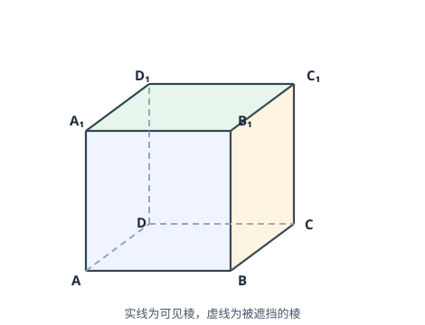
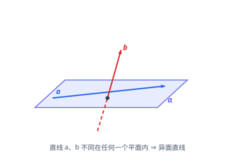

# 立体几何初步

> **范围**：必修第二册 · 第八章 ｜ 星级说明（难度 / 重要性）见[数学总览](index.md)

## 一、空间几何体的结构

> **难度**：★★☆☆☆　**重要性**：★★★☆☆

- **多面体**（★☆☆☆☆）：棱柱（两底平行全等、侧棱平行）、棱锥（一个底面、侧棱交于一点）、棱台（棱锥截得，上下底平行相似）。
- **旋转体**（★☆☆☆☆）：圆柱（矩形绕一边旋转）、圆锥（直角三角形绕直角边）、圆球（半圆绕直径）。
- **三视图**（★★☆☆☆）：正视图、侧视图、俯视图；「长对正、高平齐、宽相等」；由三视图还原几何体或求体积表面积。
- **斜二测画法**（★★☆☆☆）：$x$ 轴水平、$y$ 轴与 $x$ 轴成 $45^\circ$（或 $135^\circ$）、$z$ 轴竖直；平行于 $x$ 轴长度不变、平行于 $y$ 轴长度减半。
- **直观图与原图的面积关系**（★★★☆☆）：直观图面积 $=\dfrac{\sqrt{2}}{4}\times$ 原图面积。

## 二、表面积与体积

> **难度**：★★☆☆☆　**重要性**：★★★★☆

- **柱体体积**（★★☆☆☆）：$V=Sh$（棱柱、圆柱通用）。
- **锥体体积**（★★☆☆☆）：$V=\dfrac{1}{3}Sh$（棱锥、圆锥）。
- **台体体积**（★★★☆☆）：$V=\dfrac{h}{3}(S+S'+\sqrt{SS'})$。
- **球的表面积与体积**（★★☆☆☆）：$S=4\pi R^2$，$V=\dfrac{4}{3}\pi R^3$。
- **侧面积公式**（★★★☆☆）：圆柱 $2\pi rh$、圆锥 $\pi rl$（$l$ 为母线）；棱柱=底面周长×侧棱长相关（直棱柱 $=ch$）。
- **组合体体积**（★★★☆☆）：分割法（切成熟悉的柱锥）与补形法（补成完整体再挖去）。
- **外接球与内切球**（★★★★☆）：找球心即各顶点等距点；长方体外接球直径 $=体对角线=\sqrt{a^2+b^2+c^2}$。

## 三、点、线、面的位置关系

> **难度**：★★★☆☆　**重要性**：★★★★★

- **四个基本事实（公理）**（★★☆☆☆）：
  1. 两点确定一条直线；
  2. 两点确定一个平面（一直线与线外一点、两相交直线、两平行直线也确定一个平面）；
  3. 直线若有两个公共点在平面内，则直线在平面内；
  4. 两平面若有公共点，则公共点在交线上。
- **异面直线**（★★★☆☆）：既不平行也不相交（不同在任何一个平面内）；用**反证法**证明异面。
- **异面直线所成角**（★★★★☆）：平移至相交，取锐角（或直角），范围 $(0,\dfrac{\pi}{2}]$。
- **线线、线面、面面的平行与垂直关系**（★★★☆☆）：记清每对关系的**判定**与**性质**方向（判定是「线线 $\Rightarrow$ 线面」，性质是「线面 $\Rightarrow$ 线线」）。

## 四、直线与平面平行

> **难度**：★★★★☆　**重要性**：★★★★★

- **线面平行的判定定理**（★★★★☆）：平面外一条直线与平面内一条直线平行，则该直线与平面平行：$a \not\subset \alpha,\ b \subset \alpha,\ a \parallel b \Rightarrow a \parallel \alpha$。
- **线面平行的性质定理**（★★★★☆）：$a \parallel \alpha,\ a \subset \beta,\ \alpha \cap \beta = b \Rightarrow a \parallel b$（过 $a$ 作平面找交线）。
- **证平行的辅助线套路**（★★★★★）：中位线、平行四边形、作平面（找交线）——「见中点找中位线，见线面平行作交线」。
- **面面平行的判定**（★★★★☆）：一平面内两条**相交**直线都平行于另一平面 $\Rightarrow$ 面面平行（缺「相交」条件不成立）。
- **面面平行的性质**（★★★★☆）：两平面平行，第三个平面与它们的交线平行；两平行平面被第三平面所截交线平行。
- **由面面平行证线线平行**（★★★☆☆）：链式传递：面面平行 $\to$ 交线平行 $\to$ 线线平行。

## 五、直线与平面垂直

> **难度**：★★★★☆　**重要性**：★★★★★

- **线面垂直的判定定理**（★★★★☆）：直线与平面内**两条相交直线**都垂直 $\Rightarrow$ 线面垂直（先在面内找或作两条相交线）。
- **线面垂直的性质定理**（★★★★☆）：垂直于同一平面的两条直线平行；$a \perp \alpha,\ b \perp \alpha \Rightarrow a \parallel b$。
- **面面垂直的判定**（★★★★☆）：一个平面内有一条直线垂直于另一平面 $\Rightarrow$ 面面垂直（「线垂直面 $\to$ 面垂直面」）。
- **面面垂直的性质**（★★★★★）：$\alpha \perp \beta,\ \alpha \cap \beta = l,\ a \subset \alpha,\ a \perp l \Rightarrow a \perp \beta$（**在一面内垂直于交线则垂直于另一面**）——大题最关键的辅助线：「作交线的垂线」。
- **三垂线定理思想**（★★★★☆）：平面内一条直线垂直于斜线在平面内的射影 $\iff$ 垂直于斜线（用于快速找垂直关系）。
- **垂直关系转化链**（★★★★★）：线线垂直 $\rightleftarrows$ 线面垂直 $\rightleftarrows$ 面面垂直，证明题在三者之间循环转化。

## 六、空间角与距离（综合）

> **难度**：★★★★☆　**重要性**：★★★★☆

- **异面直线所成角**（★★★★☆）：平移法求解，范围 $(0,\dfrac{\pi}{2}]$。
- **直线与平面所成角**（★★★★☆）：斜线与射影所成锐角，范围 $[0,\dfrac{\pi}{2}]$；作垂线找射影是关键。
- **二面角**（★★★★★）：在棱上取一点分别在两面内作棱的垂线，所得平面角（或其补角）即二面角；范围 $[0,\pi]$。
- **空间距离**（★★★☆☆）：点到线（垂线段）、点到面（垂线段）、线到线（平行时转化点到面）；体积法（等体积 $V_{A-BCD}=V_{B-ACD}$）求点面距。
- **传统法（综合法）大题套路**（★★★★★）：作（找角作垂线）→ 证（证垂直关系）→ 算（解三角形算角），三步规范书写。
