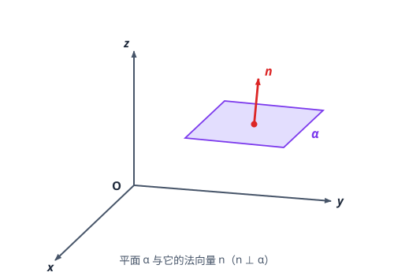
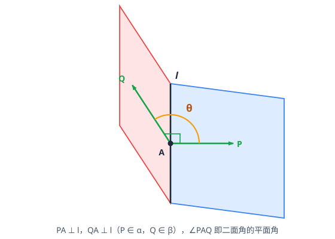

# 空间向量与立体几何

> **范围**：选择性必修第一册 · 第一章 ｜ 星级说明（难度 / 重要性）见[数学总览](index.md)

## 一、空间向量及其运算

> **难度**：★★☆☆☆　**重要性**：★★★☆☆

- **空间向量的概念**（★☆☆☆☆）：与平面向量完全类比：加减、数乘、共线条件 $\vec{b}=\lambda\vec{a}$；方向相同或相反的非零向量平行。
- **空间向量的线性运算**（★★☆☆☆）：三角形法则、平行四边形法则在空间仍成立；运算律与平面向量相同。
- **空间向量的数量积**（★★★☆☆）：$\vec{a}\cdot\vec{b}=|\vec{a}||\vec{b}|\cos\theta$；坐标运算 $x_1x_2+y_1y_2+z_1z_2$；垂直 $\Leftrightarrow$ 数量积为 0。
- **共面向量定理**（★★★☆☆）：$\vec{p}$ 与不共线向量 $\vec{a},\vec{b}$ 共面 $\Leftrightarrow \vec{p}=x\vec{a}+y\vec{b}$；空间一点 $P$ 在平面 $ABC$ 内 $\Leftrightarrow \overrightarrow{AP}=x\overrightarrow{AB}+y\overrightarrow{AC}$。

## 二、空间向量基本定理与坐标运算

> **难度**：★★★☆☆　**重要性**：★★★★☆

- **空间向量基本定理**（★★★★☆）：若 $\vec{a},\vec{b},\vec{c}$ 不共面，则空间任意向量 $\vec{r}=x\vec{a}+y\vec{b}+z\vec{c}$，且表示唯一；$\{\vec{a},\vec{b},\vec{c}\}$ 为空间的一组基底。
- **空间直角坐标系**（★★★☆☆）：建系原则——让尽可能多的点落在坐标轴或坐标面上（墙角、长方体顶点、两两垂直的三条棱）。
- **坐标运算**（★★★☆☆）：$\overrightarrow{AB}=(x_2-x_1,\ y_2-y_1,\ z_2-z_1)$；中点坐标公式、重心坐标 $\left(\dfrac{x_1+x_2+x_3}{3},\dfrac{y_1+y_2+y_3}{3},\dfrac{z_1+z_2+z_3}{3}\right)$。
- **平行与垂直的坐标条件**（★★★☆☆）：$\vec{a}\parallel\vec{b} \Leftrightarrow \dfrac{x_1}{x_2}=\dfrac{y_1}{y_2}=\dfrac{z_1}{z_2}$（分母非零时）；$\vec{a}\perp\vec{b} \Leftrightarrow x_1x_2+y_1y_2+z_1z_2=0$。

## 三、方向向量与法向量

> **难度**：★★★★☆　**重要性**：★★★★★

- **直线的方向向量**（★★★☆☆）：与直线平行的非零向量；同一直线所有方向向量共线。
- **平面的法向量**（★★★★☆）：垂直于平面内任一直线的非零向量 $\vec{n}$；求法：设 $\vec{n}=(x,y,z)$，找面内两个不共线向量 $\vec{u},\vec{v}$，解方程组 $\vec{n}\cdot\vec{u}=0,\ \vec{n}\cdot\vec{v}=0$（令一个自由元为具体值）。
- **法向量不唯一**（★★★☆☆）：相差非零倍数即可；计算时取最简整数比。
- **用向量证平行与垂直**（★★★★☆）：
  - 线面平行 $\Leftrightarrow$ 直线方向向量与法向量垂直；
  - 线面垂直 $\Leftrightarrow$ 方向向量与法向量平行；
  - 面面平行 $\Leftrightarrow$ 法向量平行；面面垂直 $\Leftrightarrow$ 法向量垂直。

## 四、空间角的向量求法

> **难度**：★★★★★　**重要性**：★★★★★

- **异面直线所成角**（★★★★☆）：取两直线方向向量 $\vec{m},\vec{n}$，则
  $$
  \cos\theta=\frac{|\vec{m}\cdot\vec{n}|}{|\vec{m}||\vec{n}|},\qquad \theta\in\left(0,\frac{\pi}{2}\right],
  $$
  即取两方向向量夹角余弦的**绝对值**。
- **直线与平面所成角**（★★★★☆）：设直线方向向量 $\vec{m}$、平面法向量 $\vec{n}$，线面角 $\theta$ 满足
  $$
  \sin\theta=|\cos\langle\vec{m},\vec{n}\rangle|=\frac{|\vec{m}\cdot\vec{n}|}{|\vec{m}||\vec{n}|},\qquad \theta\in\left[0,\frac{\pi}{2}\right].
  $$
- **二面角**（★★★★★）：在两半平面内分别取法向量 $\vec{n_1},\vec{n_2}$：
  $$
  |\cos\langle\vec{n_1},\vec{n_2}\rangle|=\frac{|\vec{n_1}\cdot\vec{n_2}|}{|\vec{n_1}||\vec{n_2}||},
  $$
  所得角与二面角**相等或互补**——必须结合图形（观察法向量方向是「同向穿出」还是「反向」）判断取锐还是钝。
- **三类角公式对照记忆**（★★★★★）：线线取 $\cos$ 绝对值、线面取 $\sin$、二面角取 $\cos$ 再判号；范围先写再算。
- **建系求角的完整步骤**（★★★★★）：建系 → 写点坐标 → 求方向向量/法向量 → 代公式 → 按范围作答。

## 五、空间距离与探索性问题

> **难度**：★★★★★　**重要性**：★★★★☆

- **空间两点距离**（★★★☆☆）：$|AB|=\sqrt{(x_2-x_1)^2+(y_2-y_1)^2+(z_2-z_1)^2}$。
- **点到平面的距离**（★★★★☆）：$\displaystyle d=\frac{|\overrightarrow{PA}\cdot\vec{n}|}{|\vec{n}|}$，其中 $A$ 为面上任一点、$\vec{n}$ 为法向量（投影法）。
- **平行线/平行面间的距离**（★★★★☆）：转化为线上任一点到平面的距离。
- **存在性与探索性问题**（★★★★★）：假设目标点存在并设坐标（或设参数 $\lambda$ 满足共线/共面），按条件列方程（垂直=数量积 0、成角=公式、距离=公式），有解即存在。
- **向量法与传统法的选择**（★★★★☆）：建系方便（有墙角、正方体、两两垂直）优先向量法；辅助线难作的角与距离用向量法更稳。
