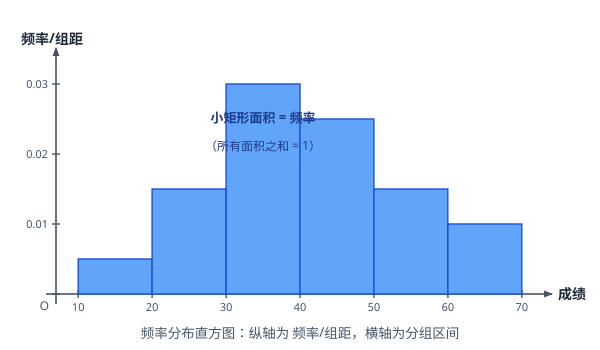
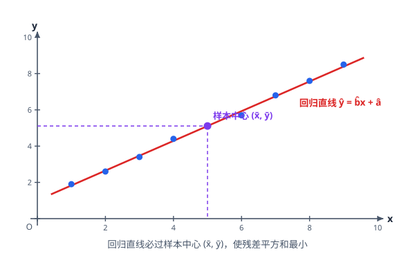

# 统计与成对数据统计分析

> **范围**：必修第二册 · 第九章 + 选择性必修第三册 · 统计 ｜ 星级说明（难度 / 重要性）见[数学总览](index.md)

## 一、抽样方法

> **难度**：★★☆☆☆　**重要性**：★★★★☆

- **简单随机抽样**（★☆☆☆☆）：逐个不放回抽取、每个个体等可能；抽签法、随机数表法；适用于**个体数较少**的总体。
- **系统抽样（等距抽样）**（★★☆☆☆）：总体均衡时分段、等距抽取（段距 $k=\dfrac{N}{n}$）；个体随机排列时代表性好。
- **分层抽样**（★★☆☆☆）：总体**差异明显**（分层）时按比例抽取：各层样本数 $=\dfrac{该层个体数}{总体数}\times n$。
- **三种方法的选择**（★★★☆☆）：层次分明用分层、个体较多且均衡用系统、小总体用简单随机；分层抽样中每个个体被抽到的概率**相等**。
- **样本的代表性**（★★☆☆☆）：随机抽样减少偏差；样本容量越大估计越可靠，但抽样方法错误无法靠加大样本弥补。

## 二、用样本估计总体

> **难度**：★★★☆☆　**重要性**：★★★★★

- **频率分布直方图**（★★☆☆☆）：纵轴为 $\dfrac{频率}{组距}$，**小矩形面积 $=$ 频率**，所有面积之和 $=1$。
- **直方图读数**（★★★★☆）：
  - 众数 $\approx$ 最高矩形中点；
  - 中位数 $\approx$ 左右面积各 $0.5$ 的分界点（累加面积）；
  - 平均数 $\approx \sum$(中点 $\times$ 频率)。
- **茎叶图**（★★☆☆☆）：保留原始数据、便于读中位数与分布形状；样本较少时使用。
- **百分位数**（★★☆☆☆）：第 $p$ 百分位数即「至少 $p\%$ 的数据不超过它」；插值位置 $=(n+1)\times p\%$ 附近（按教材口径）。
- **平均数、中位数、众数**（★★☆☆☆）：平均数受极端值影响大；中位数稳健；众数反映集中趋势的「峰值」。
- **方差与标准差**（★★★☆☆）：
  $$
  s^2=\frac{1}{n}\sum_{i=1}^n (x_i-\bar x)^2,\qquad s=\sqrt{s^2},
  $$
  衡量数据的离散程度（稳定性）。
- **数据线性变换后的数字特征**（★★★★☆）：$y_i=ax_i+b$ 时 $\bar y=a\bar x+b$，$s_y^2=a^2s_x^2$（方差随 $a^2$ 缩放，与 $b$ 无关）。
- **用样本频率估计总体概率**（★★★☆☆）：频率趋近概率；用样本均值/方差估计总体均值/方差。

## 三、相关关系与回归分析

> **难度**：★★★★☆　**重要性**：★★★★★

- **相关关系与函数关系**（★★☆☆☆）：相关关系不确定但有趋势；散点图直观判断正/负相关与线性强弱。
- **相关系数 $r$**（★★★☆☆）：
  $$
  r=\frac{\sum(x_i-\bar x)(y_i-\bar y)}{\sqrt{\sum(x_i-\bar x)^2}\sqrt{\sum(y_i-\bar y)^2}}\in[-1,1],
  $$
  $r>0$ 正相关、$r<0$ 负相关；$|r|$ 越接近 1 线性相关程度越强。
- **回归直线方程**（★★★★☆）：$\hat y=\hat b x+\hat a$（最小二乘法使残差平方和 $\sum(y_i-\hat y_i)^2$ 最小）；**必过样本中心** $(\bar x,\bar y)$：
  $$
  \hat b=\frac{\sum(x_i-\bar x)(y_i-\bar y)}{\sum(x_i-\bar x)^2},\qquad \hat a=\bar y-\hat b\bar x.
  $$
- **回归方程的求法与应用**（★★★★☆）：算 $\bar x,\bar y$ → 算 $\hat b$ → $\hat a$ → 写方程 → 代入预测；注意**预测不宜外推太远**。
- **非线性回归（换元化线性）**（★★★★☆）：$y=c_1e^{c_2x}$ 两边取对数化 $\ln y=\ln c_1+c_2x$；$y=\dfrac{a}{x+b}$ 型换元后按线性回归处理，再回代。
- **相关与因果的辨析**（★★★☆☆）：相关不等于因果；解释结论要结合实际背景。

## 四、独立性检验

> **难度**：★★★★☆　**重要性**：★★★★☆

- **$2 \times 2$ 列联表**（★★★☆☆）：两个分类变量（如「吸烟与否」×「患病与否」）的交叉计数表；计算各行列合计。
- **$\chi^2$ 统计量**（★★★★☆）：
  $$
  \chi^2=\frac{n(ad-bc)^2}{(a+b)(c+d)(a+c)(b+d)},\qquad n=a+b+c+d.
  $$
- **判断规则**（★★★☆☆）：算出 $\chi^2$ 与临界值比较——$\chi^2 \ge k_0$ 时，有 $(1-P(k_0))\times100\%$ 的把握认为「两个变量有关」；教材常给：
  | $k_0$ | 2.706 | 3.841 | 6.635 |
  |---|---|---|---|
  | $P(\chi^2 \ge k_0)$ | 0.10 | 0.05 | 0.01 |
  | 把握 | 90% | 95% | 99% |
- **独立性检验的完整表述**（★★★★☆）：算统计量 → 比临界值 → 下结论（「有 $95\%$ 的把握认为……」），**不能说「一定有关」**，显著性水平即犯错概率。
- **与概率的联系**（★★★☆☆）：$\chi^2$ 越大，「两个分类变量无关」这一假设越不可信；与条件概率判断方向一致。
