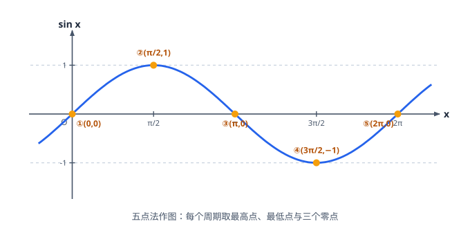
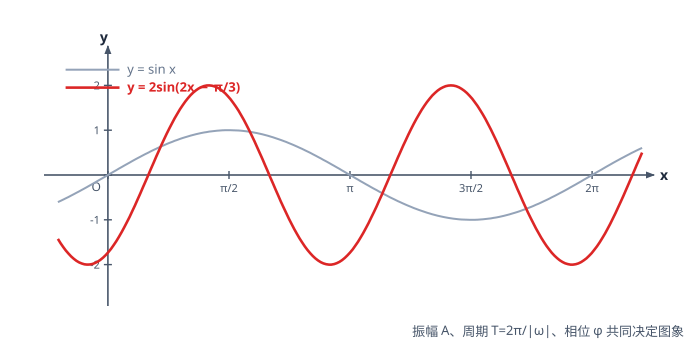

# 三角函数与恒等变换

> **范围**：必修第一册 · 第六章 ｜ 星级说明（难度 / 重要性）见[数学总览](index.md)

## 一、角的概念与弧度制

> **难度**：★★☆☆☆　**重要性**：★★★☆☆

- **任意角的概念**（★☆☆☆☆）：正角（逆时针）、负角（顺时针）、零角；终边相同的角 $\{\beta \mid \beta = k \cdot 360^\circ + \alpha,\ k \in \mathbb{Z}\}$。
- **象限角与轴线角**（★★☆☆☆）：终边落在坐标轴上的角不属于任何象限，如 $\alpha = k \cdot 90^\circ,\ k \in \mathbb{Z}$。
- **弧度制**（★★☆☆☆）：$\pi\ \text{rad} = 180^\circ$，$1$ 弧度 $\approx 57.3^\circ$；正负角弧度符号一致。
- **扇形弧长与面积**（★★☆☆☆）：$l=|\alpha|r$，$S=\dfrac{1}{2}lr=\dfrac{1}{2}|\alpha|r^2$（$\alpha$ 用弧度）。
- **扇形最值**（★★★☆☆）：周长 $l+2r$ 一定时面积最大（或面积一定时周长最短），转为基本不等式或二次函数。

## 二、三角函数的定义

> **难度**：★★★☆☆　**重要性**：★★★★☆

- **任意角三角函数的定义**（★★☆☆☆）：终边上任取点 $P(x,y)$，$r=\sqrt{x^2+y^2}$，则 $\sin\alpha=\dfrac{y}{r}$，$\cos\alpha=\dfrac{x}{r}$，$\tan\alpha=\dfrac{y}{x}$（$x \ne 0$）。
- **单位圆定义**（★★☆☆☆）：$r=1$ 时 $\sin\alpha=y,\ \cos\alpha=x$；正弦线、余弦线、正切线是有向线段。
- **各象限符号**（★☆☆☆☆）：口诀「一全正、二正弦、三正切、四余弦」。
- **同角三角函数的基本关系**（★★★☆☆）：
  $$
  \sin^2\alpha+\cos^2\alpha=1,\qquad \tan\alpha=\frac{\sin\alpha}{\cos\alpha}\ (\cos\alpha \ne 0).
  $$
- **已知 $\sin\alpha$ 求其余**（★★★★☆）：平方关系得 $|\cos\alpha|$，再由象限定符号；象限未知则**分类讨论**。
- **$\sin\alpha \pm \cos\alpha$ 与 $\sin\alpha\cos\alpha$ 互化**（★★★★☆）：$(\sin\alpha \pm \cos\alpha)^2 = 1 \pm 2\sin\alpha\cos\alpha$，知一求二（整体代换）。
- **齐次式化简**（★★★★☆）：分子分母同除 $\cos^n\alpha$ 化为 $\tan\alpha$ 表示，如 $\dfrac{\sin\alpha-\cos\alpha}{\sin\alpha+\cos\alpha}=\dfrac{\tan\alpha-1}{\tan\alpha+1}$。

## 三、诱导公式

> **难度**：★★★☆☆　**重要性**：★★★☆☆

- **诱导公式口诀**（★★★☆☆）：「**奇变偶不变，符号看象限**」——$\dfrac{k\pi}{2} \pm \alpha$ 中 $k$ 为奇数则函数名互变（$\sin \leftrightarrow \cos$），偶数则不变；符号按「把 $\alpha$ 看成锐角」时原函数在对应象限的正负确定。
- **常用两组**（★★★☆☆）：
  $$
  \sin(\pi-\alpha)=\sin\alpha,\quad \cos(\pi-\alpha)=-\cos\alpha,\quad \tan(\pi-\alpha)=-\tan\alpha;
  $$
  $$
  \sin\left(\frac{\pi}{2}-\alpha\right)=\cos\alpha,\quad \cos\left(\frac{\pi}{2}-\alpha\right)=\sin\alpha.
  $$
- **诱导公式化简求值**（★★★★☆）：先用 $2k\pi+\alpha$ 去整圈，再用 $\pi \pm \alpha$、$\dfrac{\pi}{2} \pm \alpha$ 化到锐角，逐步核对符号与函数名。

## 四、三角函数的图象与性质

> **难度**：★★★★☆　**重要性**：★★★★★

- **正弦、余弦、正切函数图象**（★★☆☆☆）：$y=\sin x$ 用「五点法」作图；$y=\tan x$ 有渐近线 $x=\dfrac{\pi}{2}+k\pi$，在每支上增。
- **周期与最小正周期**（★★☆☆☆）：$y=\sin(\omega x+\varphi)$、$y=\cos(\omega x+\varphi)$ 的最小正周期 $T=\dfrac{2\pi}{|\omega|}$；$y=\tan(\omega x+\varphi)$ 的 $T=\dfrac{\pi}{|\omega|}$；$|\sin x|$ 周期减半为 $\pi$。
- **$y=A\sin(\omega x+\varphi)$ 的图象变换**（★★★★☆）：振幅 $A$（纵向）、周期 $\omega$（横向伸缩）、相位 $\varphi$（左右平移 $\dfrac{\varphi}{\omega}$）；**先平移后伸缩**与**先伸缩后平移**的平移量不同（后者平移 $\varphi$）。
- **由图象求解析式**（★★★★☆）：读最高最低得 $A$，读周期得 $\omega$，代最高点（或平衡点）相位得 $\varphi$；注意 $\varphi$ 的取值范围限制。
- **单调区间**（★★★☆☆）：令 $u=\omega x+\varphi$，代入 $\sin u$ 的增区间 $[-\dfrac{\pi}{2}+2k\pi,\ \dfrac{\pi}{2}+2k\pi]$ 解出 $x$；$\omega<0$ 时单调性反向。
- **对称轴与对称中心**（★★★☆☆）：$\sin$ 型对称轴过最高/最低点（$u=\dfrac{\pi}{2}+k\pi$），对称中心为零点（$u=k\pi$）；$\tan$ 型只有对称中心。
- **三角函数的最值（换元法）**（★★★★☆）：令 $t=\sin x \in [-1,1]$，化为二次函数在闭区间上的最值——**先换元定区间**，再按对称轴位置讨论；或 $y=a\sin x+b\cos x$ 先辅助角再求。
- **值域综合**（★★★★★）：$\sin^2 x + \sin x \cos x$ 型先降幂 + 辅助角化为 $A\sin(2x+\varphi)+B$，由 $x$ 范围得 $2x+\varphi$ 范围再求。
- **三角函数奇偶性**（★★☆☆☆）：$y=\sin(\omega x+\varphi)$ 为奇 $\Leftrightarrow \varphi=k\pi$；为偶 $\Leftrightarrow \varphi=\dfrac{\pi}{2}+k\pi$。
- **零点与交点个数**（★★★★☆）：换元 $u=\omega x+\varphi$，把根的个数转为 $u$ 在给定区间内 $\sin u = c$ 的交点个数，注意 $x$ 范围换算成 $u$ 范围。

## 五、三角恒等变换（和差与倍角公式）

> **难度**：★★★★☆　**重要性**：★★★★★

- **两角和与差的正弦**（★★★☆☆）：
  $$
  \sin(\alpha \pm \beta)=\sin\alpha\cos\beta \pm \cos\alpha\sin\beta.
  $$
- **两角和与差的余弦**（★★★☆☆）：
  $$
  \cos(\alpha \pm \beta)=\cos\alpha\cos\beta \mp \sin\alpha\sin\beta \quad(\text{注意符号相反}).
  $$
- **两角和与差的正切**（★★★☆☆）：
  $$
  \tan(\alpha \pm \beta)=\frac{\tan\alpha \pm \tan\beta}{1 \mp \tan\alpha\tan\beta}.
  $$
- **二倍角公式**（★★★☆☆）：$\sin 2\alpha=2\sin\alpha\cos\alpha$；$\cos 2\alpha=\cos^2\alpha-\sin^2\alpha=2\cos^2\alpha-1=1-2\sin^2\alpha$；$\tan 2\alpha=\dfrac{2\tan\alpha}{1-\tan^2\alpha}$。
- **降幂公式**（★★★☆☆）：$\sin^2\alpha=\dfrac{1-\cos 2\alpha}{2}$，$\cos^2\alpha=\dfrac{1+\cos 2\alpha}{2}$——「升幂缩角、降幂扩角」。
- **辅助角公式**（★★★★☆）：
  $$
  a\sin x + b\cos x = \sqrt{a^2+b^2}\,\sin(x+\varphi),\quad \tan\varphi=\frac{b}{a},
  $$
  用于化一求周期、单调性、最值。
- **公式的逆用与变形**（★★★★☆）：$\sin\alpha\cos\beta + \cos\alpha\sin\beta$ 合并为和角；$\cos 2\alpha$ 三种形式按「已知 $\sin$ 还是 $\cos$」选择。
- **给角求值**（★★★☆☆）：非特殊角拆成特殊角的和差（$75^\circ=45^\circ+30^\circ$ 等）。
- **给值求值**（★★★★☆）：已知 $\sin\alpha,\cos\beta$ 及象限，先判符号，再将目标角拆为已知角的和差整体代换。
- **给值求角**（★★★★☆）：先求目标角**某个三角函数值**，再由给定范围锁定唯一角（范围要小到函数单调）。
- **化为 $A\sin(\omega x+\varphi)$ 型**（★★★★☆）：辅助角 + 降幂/倍角统一角，再求性质；注意 $\omega$ 与 $\varphi$ 范围。
- **图象变换综合**（★★★★★）：由变换过程反推 $\omega,\varphi$，或由部分图象求解析式再求对称中心——关键是抓住「相位」在特殊点的取值。
