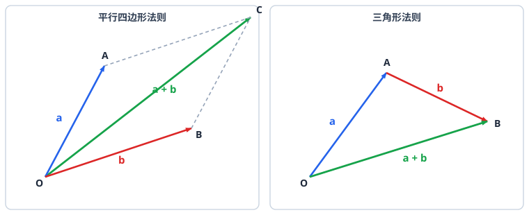

# 平面向量

> **范围**：必修第二册 · 第六章 ｜ 星级说明（难度 / 重要性）见[数学总览](index.md)

## 一、向量的概念与线性运算

> **难度**：★★☆☆☆　**重要性**：★★★☆☆

- **向量的定义**（★☆☆☆☆）：既有大小又有方向的量；**零向量** $\vec{0}$ 方向任意、$|\vec{0}|=0$；**单位向量** $|\vec{e}|=1$；相等向量要求同长同向。
- **向量的表示**（★☆☆☆☆）：几何表示 $\overrightarrow{AB}$、字母表示 $\vec{a}$、坐标表示 $\vec{a}=(x,y)$。
- **加法与减法法则**（★★☆☆☆）：三角形法则（首尾相接）、平行四边形法则；$\overrightarrow{AB}=\overrightarrow{OB}-\overrightarrow{OA}$（减法指向被减数）。
- **数乘向量**（★★☆☆☆）：$\lambda\vec{a}$：$\lambda>0$ 同向、$\lambda<0$ 反向、$|\lambda\vec{a}|=|\lambda||\vec{a}|$；运算律 $\lambda(\mu\vec{a})=(\lambda\mu)\vec{a}$、分配律。
- **共线（平行）条件**（★★★☆☆）：$\vec{b}=\lambda\vec{a}$（$\vec{a}\ne\vec{0}$）$\Rightarrow \vec{a}\parallel\vec{b}$；注意零向量与任一向量平行。

## 二、平面向量基本定理与坐标运算

> **难度**：★★★☆☆　**重要性**：★★★★☆

- **平面向量基本定理**（★★★☆☆）：若 $\vec{e_1},\vec{e_2}$ 不共线，则平面内任一向量 $\vec{a}=\lambda_1\vec{e_1}+\lambda_2\vec{e_2}$，且表示唯一；$\{\vec{e_1},\vec{e_2}\}$ 称为一组**基底**。
- **基底的判断**（★★☆☆☆）：两向量不共线即可作基底；共线（含零向量）不能作基底。
- **向量的坐标运算**（★★☆☆☆）：$\vec{a}+\vec{b}=(x_1+x_2,\ y_1+y_2)$，$\lambda\vec{a}=(\lambda x,\lambda y)$，$\overrightarrow{AB}=(x_2-x_1,\ y_2-y_1)$。
- **共线的坐标表示**（★★★☆☆）：$\vec{a}\parallel\vec{b} \Leftrightarrow x_1y_2-x_2y_1=0$。
- **三点共线问题**（★★★★☆）：$\overrightarrow{OP}=x\overrightarrow{OA}+y\overrightarrow{OB}$ 且 $A,B,P$ 共线 $\Leftrightarrow x+y=1$（$O$ 任意）。
- **用基底表示与求值**（★★★★☆）：把未知向量全部用基底表示，按线性运算律合并，再对比系数（唯一性）。

## 三、向量的数量积（点乘）

> **难度**：★★★☆☆　**重要性**：★★★★★

- **数量积的定义**（★★★☆☆）：$\vec{a}\cdot\vec{b}=|\vec{a}||\vec{b}|\cos\theta$（$\theta$ 为夹角，$\theta\in[0,\pi]$）；几何意义：$|\vec{a}|$ 乘 $\vec{b}$ 在 $\vec{a}$ 方向上的投影。
- **坐标运算**（★★★☆☆）：$\vec{a}\cdot\vec{b}=x_1x_2+y_1y_2$；$|\vec{a}|=\sqrt{x^2+y^2}$。
- **夹角公式**（★★★☆☆）：
  $$
  \cos\theta=\frac{\vec{a}\cdot\vec{b}}{|\vec{a}||\vec{b}|}=\frac{x_1x_2+y_1y_2}{\sqrt{x_1^2+y_1^2}\sqrt{x_2^2+y_2^2}}.
  $$
- **垂直的坐标条件**（★★★☆☆）：$\vec{a}\perp\vec{b} \Leftrightarrow \vec{a}\cdot\vec{b}=0 \Leftrightarrow x_1x_2+y_1y_2=0$。
- **模长与投影**（★★★☆☆）：$|\vec{a}+\vec{b}|^2=|\vec{a}|^2+2\vec{a}\cdot\vec{b}+|\vec{b}|^2$；投影 $=\dfrac{\vec{a}\cdot\vec{b}}{|\vec{a}|}$。
- **数量积求范围/最值**（★★★★☆）：$|\vec{a}+t\vec{b}|$ 型平方后化为关于 $t$ 的二次函数；「$\vec{a}\cdot\vec{b}\le|\vec{a}||\vec{b}|$」放缩求最大值。
- **由数量积求夹角与参数**（★★★★☆）：代入坐标公式列方程，注意夹角范围 $\theta\in[0,\pi]$ 与 $\cos\theta$ 符号。

## 四、平面向量的应用

> **难度**：★★★★☆　**重要性**：★★★★☆

- **向量法证平行与垂直**（★★★☆☆）：把线段写成向量，用共线条件证平行、用数量积为 0 证垂直。
- **向量与三角形「四心」**（★★★★☆）：
  - 重心 $G$：$\overrightarrow{GA}+\overrightarrow{GB}+\overrightarrow{GC}=\vec{0}$（或 $G=\dfrac{A+B+C}{3}$）；
  - 外心：到三顶点距离相等（$\overrightarrow{OA}^2=\overrightarrow{OB}^2=\overrightarrow{OC}^2$）；
  - 垂心：$\overrightarrow{HA}\cdot\overrightarrow{HB}=\overrightarrow{HB}\cdot\overrightarrow{HC}=\overrightarrow{HC}\cdot\overrightarrow{HA}$；
  - 内心：到三边距离相等（角平分线交点）。
- **向量解决几何最值**（★★★★☆）：把目标写成数量积/模的形式，用三角换元或基底分解求最值。
- **向量在物理中的应用**（★★★☆☆）：力、位移、速度的合成与分解即向量加减与数乘。
